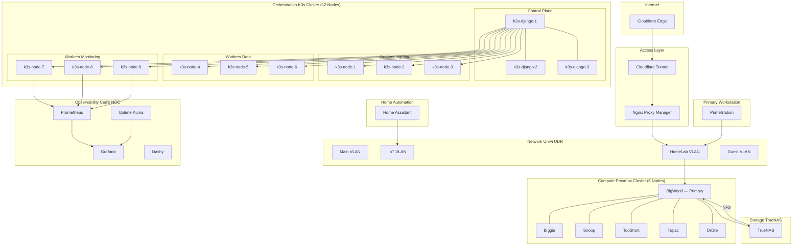
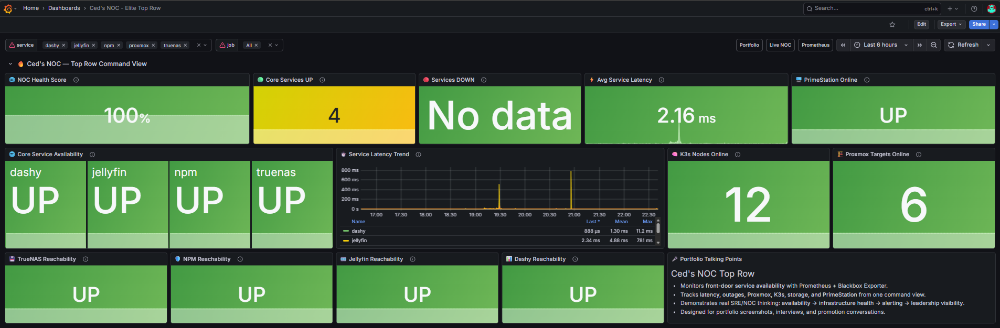

# Ced's HomeLab Live Infrastructure & Observability Platform

> A production-style homelab running real infrastructure, real workloads, and a live NOC dashboard built by a DevOps and Cloud Infrastructure Engineer at GE Aerospace who needed a place to practice what he preaches.

[](https://noc.chasedumphord.com)
[](https://chasedumphord.com)
[](#infrastructure-layer)
[](#network--vlan-architecture)

---

## Why I Built This

I'm a DevOps and Cloud Infrastructure Engineer currently on the Digital Team at GE Aerospace building data pipelines and dashboards for industrial systems.

But Ced's NOC didn't start there.

It started about five years ago with an old Dell tower I found in the trash, a few cheap upgrades, and way too much curiosity. I didn't even know what a homelab was. I just knew I wanted to see if I could make it do something useful. That server became BigWorld the primary node that still anchors this cluster today.

What started as a media server and a couple of small VMs went down a rabbit hole and never came back. Five years later it's a 6-node Proxmox cluster, a 12-node Raspberry Pi K3s cluster, a VLAN-segmented network, and a full observability stack running 24/7.

What my work at GE did was change *why* I build the way I do now. When you're working with industrial systems where downtime has real consequences, you stop treating monitoring as optional. You build it first.

The homelab reflects that. If I can't see it, I don't trust it.

---

## Architecture Overview



---

## Node Inventory

### Proxmox Cluster 6 Nodes

| Node | Role |
|------|------|
| BigWorld | Primary Proxmox node cluster anchor, original lab server |
| Biggie | Compute node |
| Snoop | Compute node |
| TooShort | Compute node |
| Tupac | Compute node |
| DrDre | Compute node |

### K3s Cluster 12 Nodes

| Node | Role |
|------|------|
| k3s-django-1 | Control Plane |
| k3s-django-2 | Control Plane |
| k3s-django-3 | Control Plane |
| k3s-node-1 | Worker — Ingress |
| k3s-node-2 | Worker — Ingress |
| k3s-node-3 | Worker — Ingress |
| k3s-node-4 | Worker — Data |
| k3s-node-5 | Worker — Data |
| k3s-node-6 | Worker — Data |
| k3s-node-7 | Worker — Monitoring |
| k3s-node-8 | Worker — Monitoring |
| k3s-node-9 | Worker — Monitoring |

### Services

| Service | Role |
|---------|------|
| TrueNAS | ZFS storage — NFS for Proxmox, SMB for media |
| Prometheus | Metrics collection and storage |
| Grafana | Dashboards and visualization |
| Uptime Kuma | Service-level uptime monitoring and alerting |
| Nginx Proxy Manager | Reverse proxy for all internal services |
| Dashy | Internal service dashboard |
| Home Assistant | IoT automation — isolated on IoT VLAN |
| PrimeStation | Primary workstation — HomeLab VLAN |

---

## Infrastructure Layers

### Infrastructure Layer Proxmox Cluster

Six-node Proxmox VE cluster anchored by BigWorld the original server that started this whole lab. TrueNAS provides centralized ZFS storage with NFS exports for VM disk images and SMB shares for media workloads.

Configs: [`proxmox/`](./proxmox/) · [`truenas/`](./truenas/) · [`home-assistant/`](./home-assistant/)

---

### Orchestration Layer K3s on Raspberry Pi

A 12-node K3s cluster running on Raspberry Pi hardware with workers segmented by role mirroring real Kubernetes production patterns at lab scale. Three dedicated control plane nodes ensure high availability. Worker groups are purpose built for ingress routing, data workloads, and monitoring collection.

Full cluster documentation: **[ced-k3s-homelab →](https://github.com/ced4568/ced-k3s-homelab)**

---

### Network & VLAN Architecture

All traffic runs through a UniFi Dream Router with hard VLAN segmentation. The HomeLab VLAN is fully isolated from daily-use devices the same network segmentation principle I apply to industrial OT/IT environments at work.

| VLAN | Purpose |
|------|---------|
| Main | Daily-use devices, workstations |
| IoT | Smart home devices, consoles, TVs |
| HomeLab | All servers, K3s nodes, storage, services |
| Guest | Guest Wi-Fi — no internal access |

**Traffic flow for external access:**
```
Internet → Cloudflare Edge → Tunnel → Nginx Proxy Manager → Internal Service
```

Zero open ports. No port forwarding. All external access goes through Cloudflare Tunnel.

Configs: [`cloudflare/`](./cloudflare/) · [`npm/`](./npm/) · [`docs/Add_New_Service_Guide.md`](./docs/Add_New_Service_Guide.md)

---

### Observability Ced's NOC

The centerpiece of this lab. A live Network Operations Center dashboard giving real-time visibility into every layer of the infrastructure.

| Tool | Role |
|------|------|
| Prometheus | Metrics collection and storage |
| Grafana | Dashboards and visualization |
| Node Exporter | Per-host system metrics (CPU, RAM, disk, network) |
| Blackbox Exporter | External endpoint and service probing |
| Uptime Kuma | Service-level uptime monitoring and alerting |

**What's monitored:**
- Proxmox host performance and VM resource usage
- K3s cluster node health and pod status
- Per-service uptime with configurable alert thresholds
- Network latency across VLANs
- TrueNAS pool health and disk utilization

**[View Live NOC Dashboard →](https://noc.chasedumphord.com)**
Configs: [`monitoring/`](./monitoring/)

---

## Screenshots

### Proxmox — Hypervisor Overview


### Proxmox — Active Workloads


### K3s — Cluster Nodes & Pods


### Nginx Proxy Manager — Reverse Proxy Routes


### Uptime Kuma — Service Monitoring


### Grafana — Infrastructure Dashboard


---

## Repository Structure

```
ceds-homelab/
├── cloudflare/         # Tunnel configs and DNS setup
├── docs/               # Architecture diagrams, guides, roadmap
│   ├── Add_New_Service_Guide.md
│   ├── Ced_Homelab_Diagrams.md
│   └── roadmap.md
├── home-assistant/     # HA configuration and automation
├── k3s/                # K3s manifests and configs
├── monitoring/         # Prometheus, Grafana, Uptime Kuma configs
├── npm/                # Nginx Proxy Manager configs
├── proxmox/            # Proxmox VM/LXC templates and notes
├── screenshots/        # Infrastructure screenshots for docs
├── soc-lab/            # Security operations lab project
└── truenas/            # TrueNAS pool and dataset configs
```

---

## Roadmap

- [x] Proxmox 6-node cluster (BigWorld, Biggie, Snoop, TooShort, Tupac, DrDre)
- [x] 12-node K3s cluster on Raspberry Pi with role-based worker groups
- [x] VLAN segmentation via UniFi (Main, IoT, HomeLab, Guest)
- [x] Cloudflare Tunnel + Nginx Proxy Manager — zero open ports
- [x] Prometheus + Grafana observability stack
- [x] Uptime Kuma service monitoring
- [x] Live NOC dashboard (noc.chasedumphord.com)
- [x] TrueNAS ZFS storage with NFS exports
- [x] Home Assistant on isolated IoT VLAN
- [ ] GitOps with ArgoCD for K3s deployments
- [ ] Helm chart library for self-hosted services
- [ ] Cloudflare Zero Trust access policies
- [ ] Internal container registry
- [ ] Automated alerting with Grafana OnCall
- [ ] Full Prometheus alerting rules library

---

## Security Practices

This repository contains **no secrets, tokens, API keys, or passwords.**

- All sensitive values are stored locally or passed via environment variables
- Template/example files use placeholder values only (.example suffix)
- External access is zero-trust via Cloudflare Tunnel no exposed ports
- VLANs enforce hard network segmentation between device classes
- Internal IPs and subnet ranges are intentionally omitted from public documentation

---

## Related Projects

| Project | Description |
|---------|-------------|
| [ced-k3s-homelab](https://github.com/ced4568/ced-k3s-homelab) | Full documentation for the 12 node Raspberry Pi K3s cluster |
| [ceds-aprs-igate](https://github.com/ced4568/ceds-aprs-igate) | Dual-node APRS RF to internet iGate (KJ5JCO) |
| [ced-portfolio](https://github.com/ced4568/ced-portfolio) | Source for chasedumphord.com |

---

## Author

**Chase Dumphord (Ced)**
DevOps and Cloud Infrastructure Engineer · GE Aerospace · Oxford, MS

Building systems that connect industrial hardware to actionable data.

[](https://chasedumphord.com)
[](https://www.linkedin.com/in/chase-dumphord/)
[](https://github.com/ced4568)
[](https://noc.chasedumphord.com)