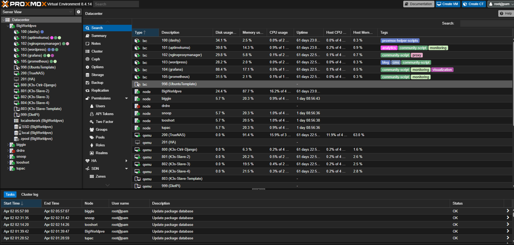
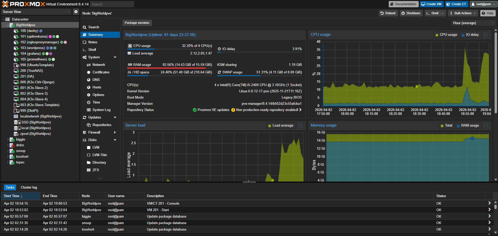
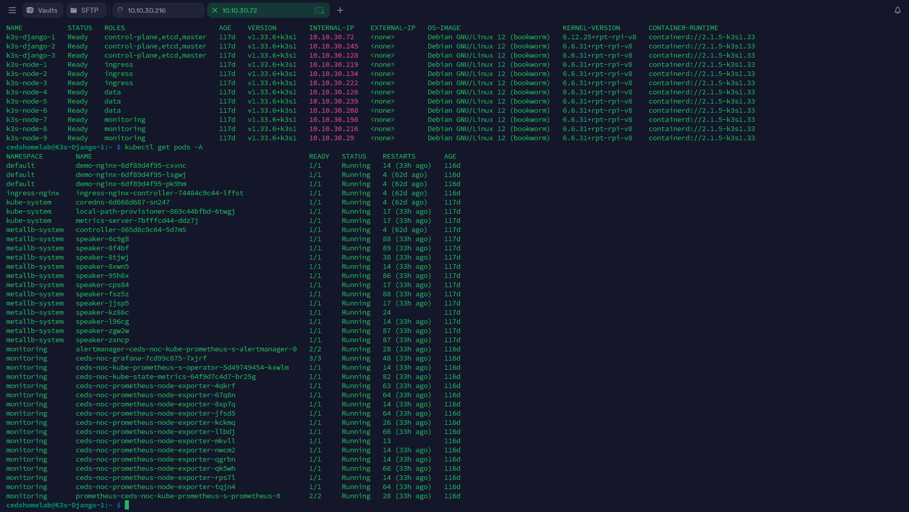
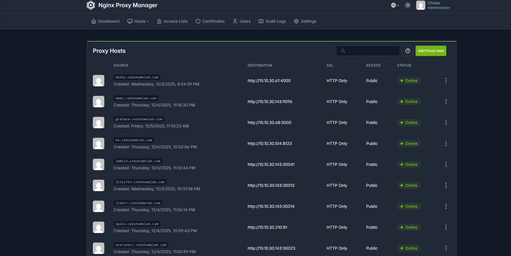
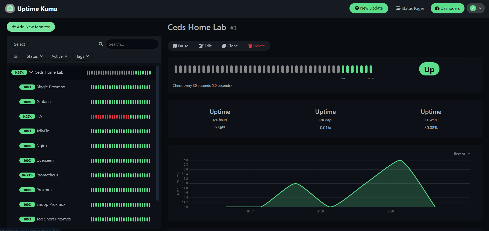

# 🧠 Ced’s HomeLab (Enterprise Infrastructure & Monitoring Lab)

A production-style homelab designed to simulate real-world infrastructure, system monitoring, and service delivery.

This environment functions as a **personal datacenter**, combining virtualization, Kubernetes orchestration, observability, and secure external access.

---

## 🚀 What This Lab Demonstrates

- Infrastructure design (Proxmox + virtualized services)
- Kubernetes orchestration (12-node K3s cluster)
- Network segmentation (VLAN architecture)
- Monitoring & observability (Grafana, Prometheus, Uptime Kuma)
- Secure service exposure (Cloudflare Tunnels + reverse proxy)
- Real-world system integration (data, services, automation)

## 🔥 Featured Project: SOC Lab

A focused project within this homelab that demonstrates monitoring, logging, and security concepts.

👉 [View SOC Lab Project](soc-lab/README.md)
---

## 🏗️ Architecture Overview

This lab is built around three core layers:

### 🖥️ Infrastructure Layer
- Proxmox VE hypervisor
- Virtual Machines + LXC containers
- TrueNAS storage backend (ZFS, NFS, SMB)

### ☸️ Orchestration Layer
- 12-node K3s Kubernetes cluster
- Workload segmentation (ingress, data, monitoring)
- MetalLB + NGINX ingress

### 🌐 Access & Networking Layer
- VLAN segmented network (UDR)
- Nginx Proxy Manager
- Cloudflare Tunnel (zero port-forwarding)

---

## 🎯 Purpose

This lab is designed to:

- Simulate production-style environments
- Build hands-on infrastructure experience
- Develop monitoring and system visibility skills
- Serve as a real-world engineering portfolio project

---

## 📸 Key System Views

### 🖥️ Proxmox Infrastructure

### 🖥️ Proxmox Workloads

### ☸️ K3s Cluster Nodes & Pods

### 🌐 Reverse Proxy (Nginx Proxy Manager)

### 📊 Service Monitoring (Uptime Kuma)

---

## 🌐 Network & VLANs

The lab runs behind a UniFi Dream Router (UDR) with VLAN segmentation:

| Network | Subnet | Purpose |
|--------|--------|--------|
| Main | 10.10.10.0/24 | Daily-use devices |
| MyHomeIOT | 10.10.20.0/24 | IoT devices, TVs, consoles |
| HomeLab | 10.10.30.0/24 | Servers, services, K3s, storage |
| Guest | 10.10.99.0/24 | Guest Wi-Fi |

The HomeLab VLAN (10.10.30.0/24) hosts all core infrastructure.

---

## 🧱 Core Components

### 🖥️ Proxmox VE
- Main hypervisor for VMs and LXCs
- Future expansion to a Proxmox cluster (+5 nodes)
- Uses TrueNAS for shared storage (NFS / iSCSI)  
📁 See: `proxmox/`

---

### 💾 TrueNAS (ZFS Storage)
- Manages ZFS pools and datasets
- NFS exports for Proxmox VM storage
- SMB / media dataset for Jellyfin & Arr stack  
📁 See: `truenas/`

---

### ☸️ K3s Raspberry Pi Cluster
A 12-node K3s cluster built on Raspberry Pi hardware for orchestrating containerized workloads across the lab.

Current and planned uses include:

- Containerized applications
- Ingress-based routing
- Monitoring workloads
- Future GitOps and Helm-based deployments

📌 Full cluster repo:  
https://github.com/ced4568/ced-k3s-homelab

---

### 🌐 Reverse Proxy & Cloudflare Tunnel
- Nginx Proxy Manager (NPM)
- Cloudflare Tunnel (no port forwarding)
- Wildcard DNS: `*.cedshomelab.com`

**Traffic Flow:**
Internet → Cloudflare Edge → Tunnel → NPM → Internal Services

📁 Docs: `docs/Add_New_Service_Guide.md`

---

### 🏠 Home Automation
- Home Assistant (Proxmox VM)
- IoT isolated on MyHomeIOT VLAN
- Secure access via Cloudflare + NPM
- `trusted_proxies` configured

📁 Config: `home-assistant/`

---

### 📊 Observability (Ced’s NOC)

The lab includes an observability stack built around:

- Prometheus for metrics collection
- Grafana for dashboards and visualization
- Uptime Kuma for service-level monitoring

Current and planned monitoring coverage includes:
- Proxmox performance
- K3s cluster health
- Service uptime
- Infrastructure visibility improvements over time

📁 See: `monitoring/`

---

## 🧭 Documentation

- Add new service: `docs/Add_New_Service_Guide.md`
- Architecture diagrams: `docs/Ced_Homelab_Diagrams.md`
- Roadmap: `docs/roadmap.md`

---

## 🚀 Future Plans

- Full Proxmox cluster
- Cloudflare Zero Trust integration
- GitOps for K3s deployments
- Internal container registry
- Advanced monitoring + alerting
- Portfolio site:
  - chasedumphord.com  
  - cedshomelab.com  

---

## ⚠️ Security Practices

This repo never stores:

- API tokens  
- Private keys  
- Passwords  
- Sensitive configs  

All secrets are handled locally or via `.example` files.

---

## 👤 Author

**Chase Dumphord**  
Digital Systems Engineer | Infrastructure | Data Systems | Automation  

LinkedIn: https://www.linkedin.com/in/toochase-dumphord/  
GitHub: https://github.com/ced4568
