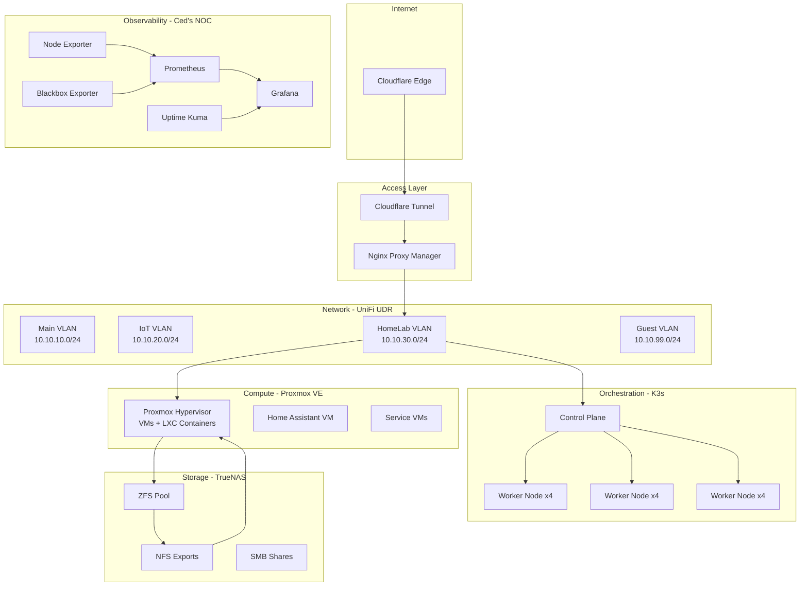

# Ced's HomeLab — Live Infrastructure & Observability Platform

> A production-style homelab running real infrastructure, real workloads, and a live NOC dashboard — built by a Digital Systems Engineer at GE Aerospace who needed a place to practice what he preaches.

[](https://noc.chasedumphord.com)
[](https://chasedumphord.com)
[](#infrastructure-layer)
[](#network--vlan-architecture)

---

## Why I Built This

I work on the Digital Team at GE Aerospace building data pipelines, dashboards, and digital inspection systems. Every day I'm working with production infrastructure where downtime has real consequences — and I needed a lab environment that could keep up with that.

This isn't a tutorial setup. Every service running here solves a real problem, every VLAN exists for a real reason, and every monitoring alert has a real threshold. I built this the same way I build at work: start with architecture, document as you go, and make it observable from day one.

**What this lab is for:**
- Practicing infrastructure patterns I apply directly at GE
- Building a live, always-on NOC that demonstrates real observability skills
- Running workloads that would otherwise require expensive cloud resources
- Documenting systems well enough that anyone can understand them

---

## Architecture Overview



---

## Infrastructure Layers

### Infrastructure Layer — Proxmox VE

The hypervisor layer runs on a dedicated server hosting all VMs and LXC containers. TrueNAS provides centralized ZFS storage with NFS exports for VM disk images and SMB shares for media workloads.

| Component | Role |
|-----------|------|
| Proxmox VE | Primary hypervisor — VMs and LXC containers |
| TrueNAS | ZFS storage backend — NFS for Proxmox, SMB for media |
| Home Assistant | IoT automation, isolated on its own VLAN |

📁 Configs: [`proxmox/`](./proxmox/) · [`truenas/`](./truenas/) · [`home-assistant/`](./home-assistant/)

---

### Orchestration Layer — K3s on Raspberry Pi

A 12-node K3s cluster running on Raspberry Pi hardware. Designed to mirror real Kubernetes production patterns at small scale — not just "run some pods."

| Layer | Detail |
|-------|--------|
| Cluster size | 12 nodes (Raspberry Pi) |
| Ingress | MetalLB + NGINX Ingress Controller |
| DNS | Wildcard `*.cedshomelab.com` via Cloudflare |
| Workloads | Monitoring stack, containerized services, future GitOps |

📌 Full cluster documentation: **[ced-k3s-homelab →](https://github.com/ced4568/ced-k3s-homelab)**

---

### Network & VLAN Architecture

All traffic runs through a UniFi Dream Router with hard VLAN segmentation. The HomeLab VLAN is fully isolated from daily-use devices — the same principle I apply to industrial OT/IT network segmentation at work.

| VLAN | Subnet | Purpose |
|------|--------|---------|
| Main | `10.10.10.0/24` | Daily-use devices, workstations |
| IoT | `10.10.20.0/24` | Smart home devices, consoles, TVs |
| HomeLab | `10.10.30.0/24` | All servers, K3s nodes, storage, services |
| Guest | `10.10.99.0/24` | Guest Wi-Fi — no internal access |

**Traffic flow for external access:**
```
Internet → Cloudflare Edge → Tunnel → Nginx Proxy Manager → Internal Service
```

Zero open ports. No port forwarding. All external access goes through Cloudflare Tunnel.

📁 Configs: [`cloudflare/`](./cloudflare/) · [`npm/`](./npm/) · [`docs/Add_New_Service_Guide.md`](./docs/Add_New_Service_Guide.md)

---

### Observability — Ced's NOC

The centerpiece of this lab. A live Network Operations Center dashboard that gives real-time visibility into every layer of the infrastructure.

**Stack:**

| Tool | Role |
|------|------|
| Prometheus | Metrics collection and storage |
| Grafana | Dashboards and visualization |
| Node Exporter | Per-host system metrics (CPU, RAM, disk, network) |
| Blackbox Exporter | External endpoint/service probing |
| Uptime Kuma | Service-level uptime monitoring and alerting |

**What's monitored:**
- Proxmox host performance and VM resource usage
- K3s cluster node health and pod status
- Per-service uptime with configurable alert thresholds
- Network latency across VLANs
- TrueNAS pool health and disk utilization

📺 **[View Live NOC Dashboard →](https://noc.chasedumphord.com)**
📁 Configs: [`monitoring/`](./monitoring/)

---

## Screenshots

### Proxmox — Hypervisor Overview


### Proxmox — Active Workloads


### K3s — Cluster Nodes & Pods


### Nginx Proxy Manager — Reverse Proxy Routes


### Uptime Kuma — Service Monitoring


### Grafana — Infrastructure Dashboard


---

## Repository Structure

```
ceds-homelab/
├── cloudflare/         # Tunnel configs and DNS setup
├── docs/               # Architecture diagrams, guides, roadmap
│   ├── Add_New_Service_Guide.md
│   ├── Ced_Homelab_Diagrams.md
│   └── roadmap.md
├── home-assistant/     # HA configuration and automation
├── k3s/                # K3s manifests and configs
├── monitoring/         # Prometheus, Grafana, Uptime Kuma configs
├── npm/                # Nginx Proxy Manager configs
├── proxmox/            # Proxmox VM/LXC templates and notes
├── screenshots/        # Infrastructure screenshots for docs
├── soc-lab/            # Security operations lab project
└── truenas/            # TrueNAS pool and dataset configs
```

---

## Roadmap

- [x] Proxmox hypervisor with VM/LXC workloads
- [x] 12-node K3s cluster on Raspberry Pi
- [x] VLAN segmentation via UniFi
- [x] Cloudflare Tunnel + Nginx Proxy Manager
- [x] Prometheus + Grafana observability stack
- [x] Uptime Kuma service monitoring
- [x] Live NOC dashboard (noc.chasedumphord.com)
- [ ] GitOps with ArgoCD for K3s deployments
- [ ] Helm chart library for self-hosted services
- [ ] Cloudflare Zero Trust access policies
- [ ] Internal container registry
- [ ] Automated alerting with PagerDuty or Grafana OnCall
- [ ] Full Proxmox cluster expansion (6-node)

---

## Security Practices

This repository contains **no secrets, tokens, API keys, or passwords.**

- All sensitive values are stored locally or passed via environment variables
- Template/example files use placeholder values only (`.example` suffix)
- External access is zero-trust via Cloudflare Tunnel — no exposed ports
- VLANs enforce hard network segmentation between device classes

---

## Related Projects

| Project | Description |
|---------|-------------|
| [ced-k3s-homelab](https://github.com/ced4568/ced-k3s-homelab) | Full documentation for the 12-node Raspberry Pi K3s cluster |
| [ceds-aprs-igate](https://github.com/ced4568/ceds-aprs-igate) | Dual-node APRS RF-to-internet iGate (KJ5JCO) |
| [ced-portfolio](https://github.com/ced4568/ced-portfolio) | Source for chasedumphord.com |

---

## Author

**Chase Dumphord (Ced)**
Digital Systems Engineer · GE Aerospace · Oxford, MS

Building systems that connect industrial hardware to actionable data.

[](https://chasedumphord.com)
[](https://www.linkedin.com/in/chase-dumphord/)
[](https://github.com/ced4568)
[](https://noc.chasedumphord.com)