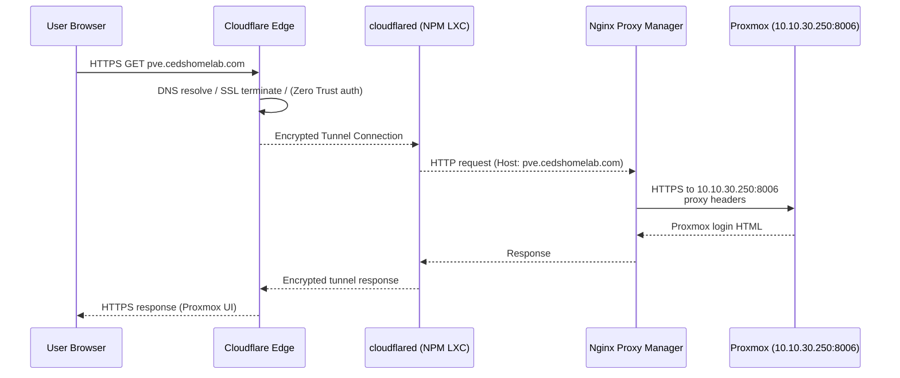
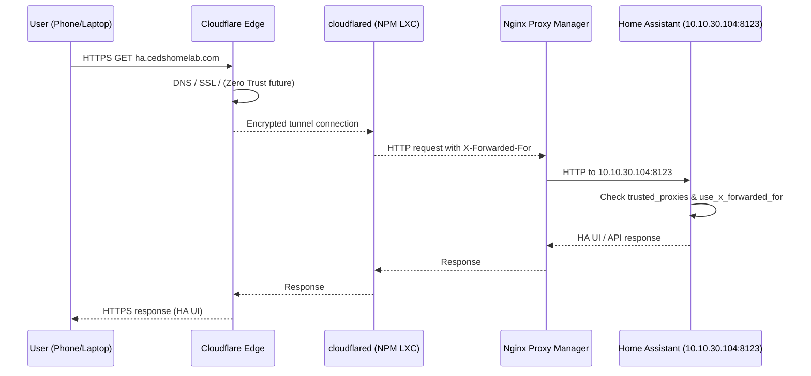

# Ced's HomeLab – Network & Cloud Architecture Diagrams

This file contains **Mermaid diagrams** for:

- Cloud & homelab architecture
- VLAN segmentation
- Request flows (Proxmox, Home Assistant)

You can view or edit them with:
- Mermaid Live Editor: https://mermaid.live
- Draw.io (Arrange → Insert → Advanced → Mermaid)
- GitHub / Obsidian / VS Code (Mermaid support)

---

## 1. High-Level Cloud & Homelab Architecture

```mermaid
graph TD
    subgraph Internet["🌐 Internet"]
        User[User Browser]
    end

    subgraph Cloudflare["Cloudflare Edge"]
        CF_DNS[DNS & SSL]
        CF_ZT[Zero Trust (future)]
    end

    subgraph Tunnel["Cloudflare Tunnel"]
        CF_Tunnel[cloudflared<br/>NPM LXC]
    end

    subgraph HomeLab_VLAN["HomeLab VLAN 10.10.30.0/24"]
        NPM[Nginx Proxy Manager<br/>10.10.30.210]
        PVE[Proxmox VE Host<br/>10.10.30.250]
        TRUENAS[TrueNAS & Media<br/>10.10.30.143]
        HA[Home Assistant<br/>10.10.30.104]

        subgraph K3S["Raspberry Pi K3s Cluster<br/>12 nodes"]
            K3S_M[Masters]
            K3S_W[Workers]
        end

        subgraph OBS["Observability Stack"]
            GRAF[Grafana]
            PROM[Prometheus]
            UPTK[Uptime Kuma]
        end

        subgraph MEDIA["Media & Arr Suite"]
            ARR[Sonarr/Radarr/etc.]
            JF[Jellyfin]
        end
    end

    User -->|"https://*.cedshomelab.com"| CF_DNS --> CF_ZT
    CF_ZT --> CF_Tunnel --> NPM

    NPM -->|"dashy.cedshomelab.com"| NPM
    NPM -->|"pve.cedshomelab.com"| PVE
    NPM -->|"truenas.cedshomelab.com"| TRUENAS
    NPM -->|"ha.cedshomelab.com"| HA
    NPM -->|"jellyfin.cedshomelab.com"| JF
    NPM -->|"grafana.cedshomelab.com"| GRAF
    NPM -->|"prometheus.cedshomelab.com"| PROM
    NPM -->|"uptime.cedshomelab.com"| UPTK
    NPM -->|"arr.cedshomelab.com"| ARR

    PVE -.-> OBS
    PVE -.-> MEDIA
    PVE -.-> K3S
    TRUENAS -. Storage .- PVE
    TRUENAS -. Media Storage .- JF
```

---

## 2. VLAN & Network Segmentation Diagram

```mermaid
flowchart LR
    subgraph UDR["UniFi Dream Router (UDR)"]
        GW_MAIN["VLAN Main 10.10.10.1"]
        GW_IOT["VLAN IoT 10.10.20.1"]
        GW_LAB["VLAN HomeLab 10.10.30.1"]
        GW_GUEST["VLAN Guest 10.10.99.1"]
    end

    subgraph VLAN_MAIN["Main Network 10.10.10.0/24"]
        DEV1[Phones / Laptops / PCs]
    end

    subgraph VLAN_IOT["MyHomeIOT 10.10.20.0/24"]
        IOT1[IoT Devices]
        TV[Smart TVs / Consoles]
    end

    subgraph VLAN_LAB["Ced's HomeLab 10.10.30.0/24"]
        PVE[Proxmox Host(s)]
        NPM[Nginx Proxy Manager<br/>+ cloudflared]
        TRUENAS[TrueNAS]
        HA[Home Assistant]
        K3S["K3s Pi Cluster"]
        OBS[Grafana / Prometheus / Uptime Kuma]
        MEDIA[Arr Suite / Jellyfin]
    end

    subgraph VLAN_GUEST["Guest Network 10.10.99.0/24"]
        GUEST_DEV[Guest Devices]
    end

    UDR --- VLAN_MAIN
    UDR --- VLAN_IOT
    UDR --- VLAN_LAB
    UDR --- VLAN_GUEST

    VLAN_MAIN -->|Restricted Access| VLAN_LAB
    VLAN_IOT -->|HA API Only| HA
    VLAN_GUEST -->|Internet Only| UDR

    VLAN_LAB -->|Cloudflare Tunnel<br/>Outbound Only| NPM
```

---

## 3. Request Flow – Proxmox via `pve.cedshomelab.com`



---

## 4. Request Flow – Home Assistant via `ha.cedshomelab.com`



---

## 5. Notes

- Cloudflare Zero Trust can be layered in front of any critical service.
- External entrypoint is always `*.cedshomelab.com`.
- Only outbound traffic from the HomeLab VLAN is required.
