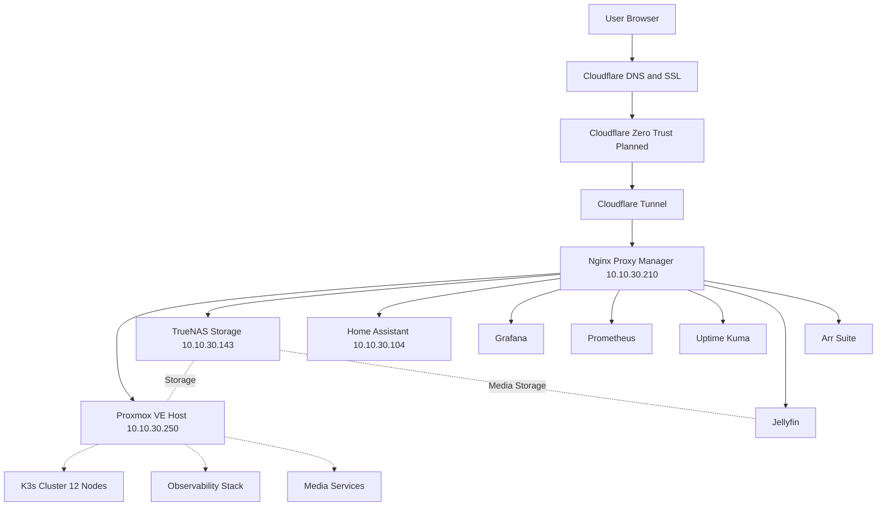
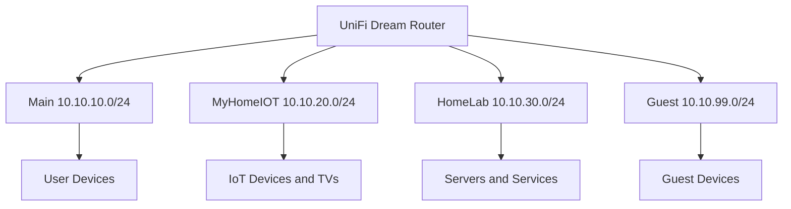
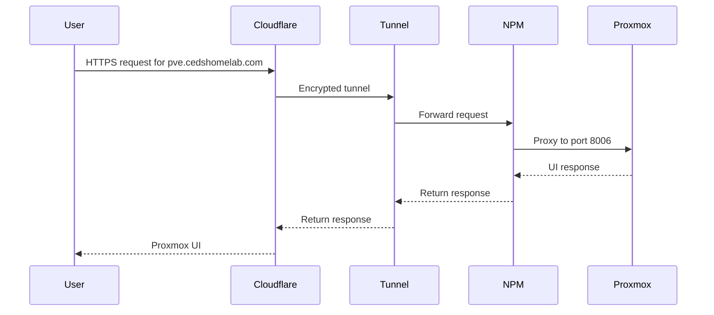
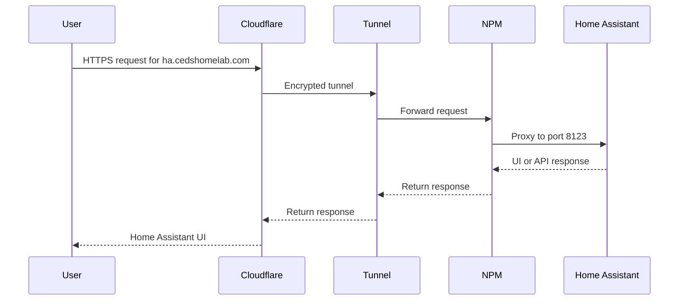

# 🧠 Ced's HomeLab - Architecture & Network Diagrams

This document provides visual representations of the Ced's HomeLab environment, including:

- 🌐 Cloud and homelab architecture  
- 🧩 VLAN segmentation  
- 🔄 Request flow through Cloudflare, reverse proxy, and internal services  

These diagrams explain how infrastructure components interact and how services are exposed.

---

## 🛠️ Viewing & Editing

You can view or edit these diagrams using:

- Mermaid Live Editor: https://mermaid.live  
- Draw.io → Arrange → Insert → Advanced → Mermaid  
- GitHub / VS Code with Mermaid support  

---

## 🌐 1. High-Level Cloud & Homelab Architecture

```mermaid
graph TD
    User[User Browser] --> CFDNS[Cloudflare DNS and SSL]
    CFDNS --> CFZT[Cloudflare Zero Trust Planned]
    CFZT --> CFTUN[Cloudflare Tunnel]
    CFTUN --> NPM[Nginx Proxy Manager 10.10.30.210]

    NPM --> PVE[Proxmox VE Host 10.10.30.250]
    NPM --> TRUENAS[TrueNAS Storage 10.10.30.143]
    NPM --> HA[Home Assistant 10.10.30.104]
    NPM --> GRAF[Grafana]
    NPM --> PROM[Prometheus]
    NPM --> UPTK[Uptime Kuma]
    NPM --> JF[Jellyfin]
    NPM --> ARR[Arr Suite]

    PVE -.-> K3S[K3s Cluster 12 Nodes]
    PVE -.-> OBS[Observability Stack]
    PVE -.-> MEDIA[Media Services]
    TRUENAS -. Storage .- PVE
    TRUENAS -. Media Storage .- JF
```

---

## 🧩 2. VLAN & Network Segmentation

```mermaid
graph TD
    UDR[UniFi Dream Router]

    MAIN[Main 10.10.10.0/24]
    IOT[MyHomeIOT 10.10.20.0/24]
    LAB[HomeLab 10.10.30.0/24]
    GUEST[Guest 10.10.99.0/24]

    DEV[User Devices]
    IOTDEV[IoT Devices and TVs]
    LABDEV[Servers and Services]
    GDEV[Guest Devices]

    UDR --> MAIN
    UDR --> IOT
    UDR --> LAB
    UDR --> GUEST

    MAIN --> DEV
    IOT --> IOTDEV
    LAB --> LABDEV
    GUEST --> GDEV
```

---

## 🔄 3. Request Flow - Proxmox Access

```mermaid
sequenceDiagram
    participant User
    participant CF as Cloudflare
    participant Tunnel
    participant NPM
    participant PVE as Proxmox

    User->>CF: HTTPS request for pve.cedshomelab.com
    CF->>Tunnel: Encrypted tunnel
    Tunnel->>NPM: Forward request
    NPM->>PVE: Proxy to port 8006
    PVE-->>NPM: UI response
    NPM-->>Tunnel: Return response
    Tunnel-->>CF: Return response
    CF-->>User: Proxmox UI
```

---

## 🔄 4. Request Flow - Home Assistant

```mermaid
sequenceDiagram
    participant User
    participant CF as Cloudflare
    participant Tunnel
    participant NPM
    participant HA as Home Assistant

    User->>CF: HTTPS request for ha.cedshomelab.com
    CF->>Tunnel: Encrypted tunnel
    Tunnel->>NPM: Forward request
    NPM->>HA: Proxy to port 8123
    HA-->>NPM: UI or API response
    NPM-->>Tunnel: Return response
    Tunnel-->>CF: Return response
    CF-->>User: Home Assistant UI
```

---

## 🧠 Notes

- 🌐 All external access is routed through Cloudflare Tunnel  
- 🚫 No inbound port forwarding is required  
- 🔗 Services are exposed via subdomains under `cedshomelab.com`  
- 🧩 VLAN segmentation reduces unnecessary lateral movement  
- 🔐 Cloudflare Zero Trust can be layered on sensitive services  
